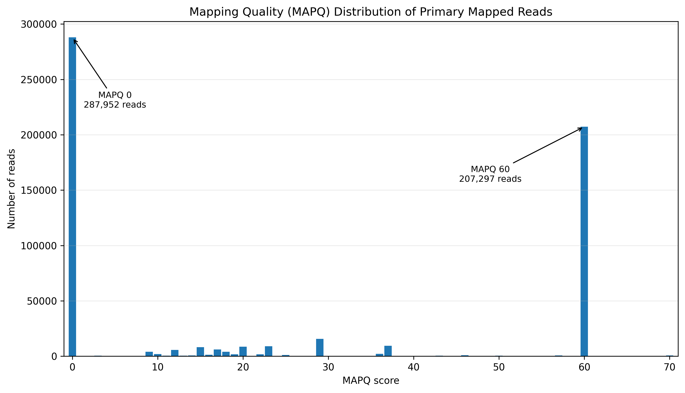
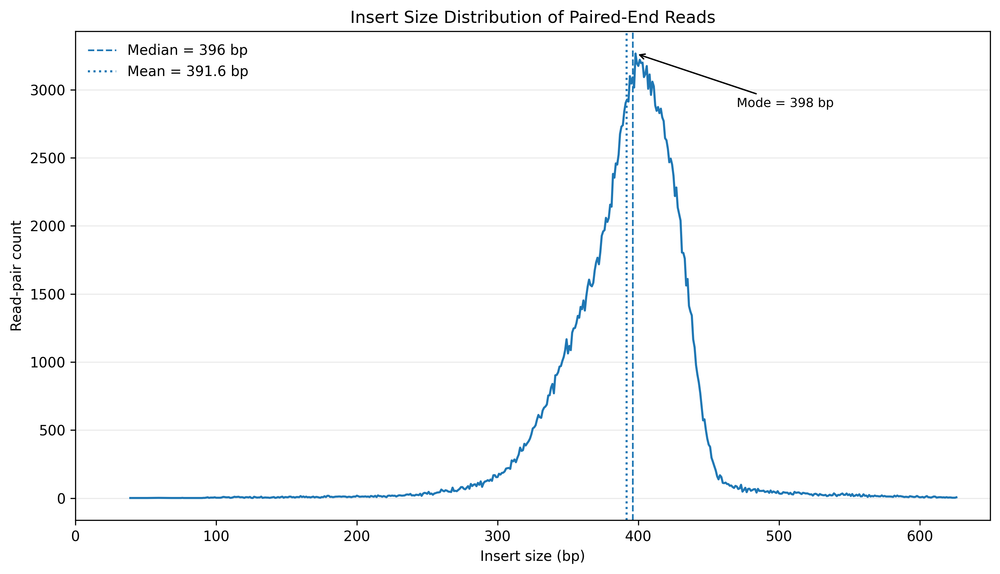
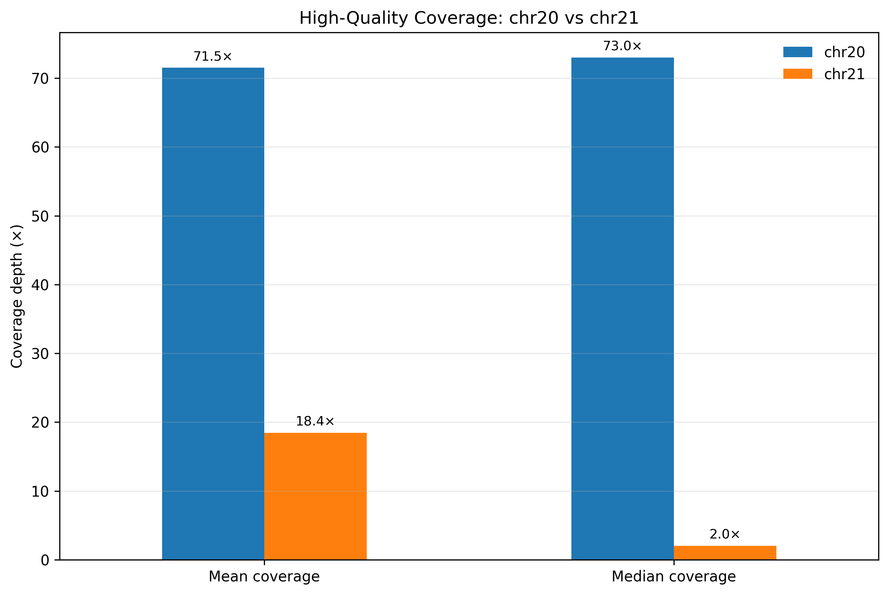
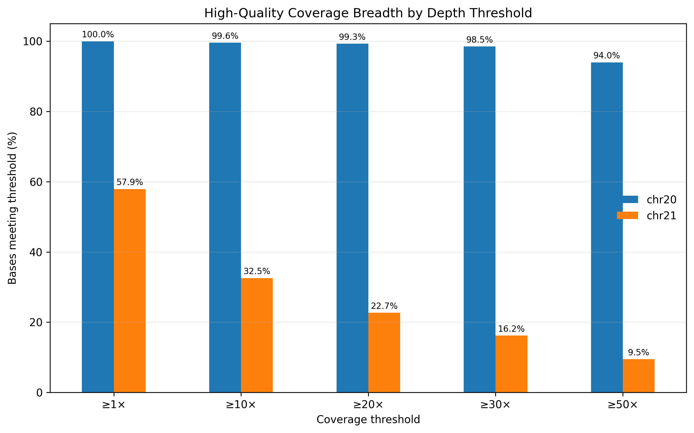

# WGS BAM Quality Control Analysis

Post-alignment quality-control analysis of a public NA12878 WGS test BAM.

## Analyses
- BAM validation
- Alignment summary metrics
- MAPQ distribution
- Insert-size analysis
- Coverage/depth analysis
- chr20 vs chr21 regional comparison

## Dataset
**Sample:** NA12878  
**Reference:** GRCh37 / b37  
**BAM:** `CEUTrio.HiSeq.WGS.b37.NA12878.20.21.bam`

The BAM file is not included in this repository because of file size.

## Tools
- Picard Tools 3.5.0
- OpenJDK 17
- PowerShell

## Main results

| Metric | Result |
|---|---:|
| Total reads | 654,610 |
| Primary mapped reads | 583,884 |
| Mapping rate | 89.20% |
| MAPQ = 0 | 49.32% |
| MAPQ >= 20 | 44.59% |
| MAPQ >= 30 | 38.41% |
| Reads aligned in pairs | 96.45% |
| Median insert size | 396 bp |

## Regional coverage comparison

| Metric | chr20 | chr21 |
|---|---:|---:|
| Mean high-quality coverage | 71.55x | 18.43x |
| Median high-quality coverage | 73x | 2x |
| Excluded by MAPQ | 0.58% | 88.68% |
| >=30x coverage | 98.48% | 16.20% |

The high MAPQ=0 rate was strongly localized to the chromosome 21 test region rather than representing a global sequencing-quality problem.

## Figures









## Repository structure

```text
wgs-bam-qc-analysis/
├── README.md
├── .gitignore
├── figures/
├── results/
├── scripts/
└── report/
```

Large source files such as BAM, SAM, FASTA references and `picard.jar` are intentionally excluded.
